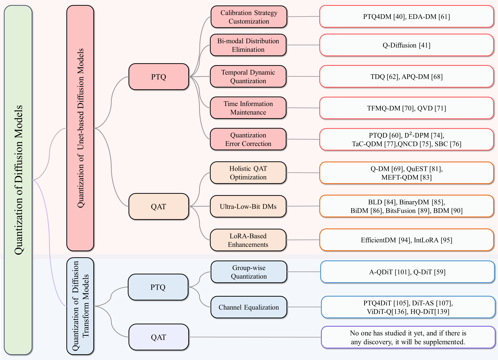
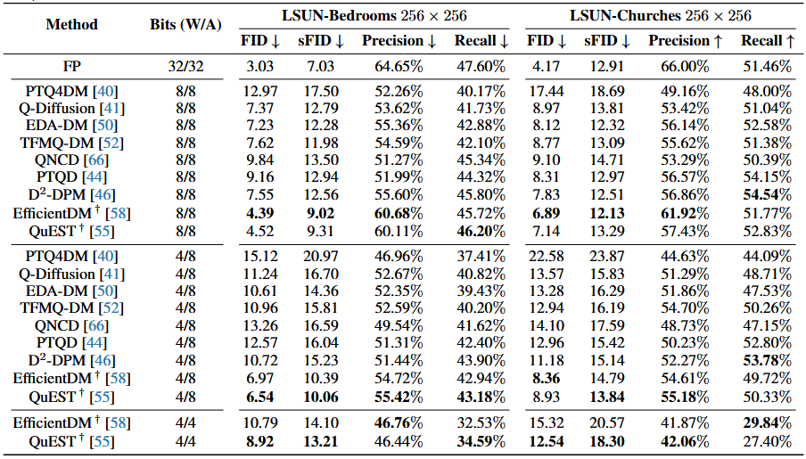
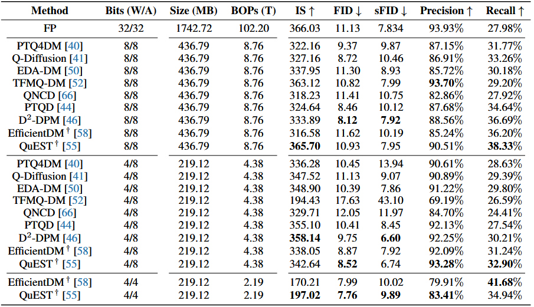
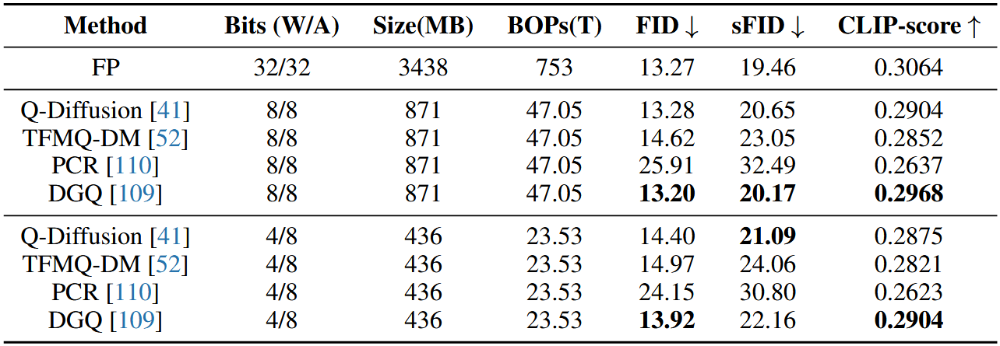

# Diffusion-Model-Quantization 

Selected papers, corresponding codes and pre-trained models in our review paper

<!-- **"Neural Style Transfer: A Review" [[arXiv Version]](https://arxiv.org/abs/1705.04058) [[IEEE Version]](https://ieeexplore.ieee.org/document/8732370)** -->

*If I missed your paper in this review, please email me or just pull a request here. I am more than happy to add it. Thanks!*

<!-- 
## Citation 
If you find this repository useful for your research, please consider citing

```
@article{jing2019neural,
  title={Neural Style Transfer: A Review},
  author={Jing, Yongcheng and Yang, Yezhou and Feng, Zunlei and Ye, Jingwen and Yu, Yizhou and Song, Mingli},
  journal={IEEE Transactions on Visualization and Computer Graphics},
  year={2019}
}
```
Please also consider citing our ECCV paper and AAAI (Oral) paper:

```
@inproceedings{jing2018stroke,
  title={Stroke Controllable Fast Style Transfer with Adaptive Receptive Fields},
  author={Jing, Yongcheng and Liu, Yang and Yang, Yezhou and Feng, Zunlei and Yu, Yizhou and Tao, Dacheng and Song, Mingli},
  booktitle={ECCV},
  year={2018}
}
```
```
@inproceedings{jing2020dynamic,
  title={Dynamic Instance Normalization for Arbitrary Style Transfer},
  author={Jing, Yongcheng and Liu, Xiao and Ding, Yukang and Wang, Xinchao and Ding, Errui and Song, Mingli and Wen, Shilei},
  booktitle={AAAI},
  year={2020}
}
```

Thanks! -->

---

## *News!*

- [April, 2025] Published a review! Summarized the current mainstream quantization methods for diffusion models.
<p align='center'>
    </br>
    
</p>

<!-- ## Materials corresponding to Our Paper

:white_check_mark: [**Supplementary Material (TVCG)**](https://drive.google.com/file/d/1_VTS4rUSl488wgSrz2K5BfKra33gvaHH/view?usp=sharing)

:white_check_mark: [**Pre-trained Models**](https://www.dropbox.com/s/37lje23pb75ecob/Models_neuralStyleTransferReview.zip?dl=0)

:white_check_mark: [**Images (TVCG)(.png)**](https://drive.google.com/file/d/14RN0GN09-rordzRqp4o8oU30BB7uiNcj/view?usp=sharing) -->

## A Taxonomy of Contemporary Approaches
<table border="1" style="border-collapse: collapse;">
    <tr>
        <th style="font-weight: bold; border: 1px solid black;">Diffusion Backbone Types</th>
        <th style="font-weight: bold; border: 1px solid black;">Quantization Methods</th>
        <th style="font-weight: bold; border: 1px solid black;">Paper&Code</th>
    </tr>
    <tr>
        <td rowspan="22" colspan="1" style="border: 1px solid black;"><b>Unet-based Diffusion Quantization</b></td>
        <td rowspan="2" colspan="1" style="border: 1px solid black;"><b>Calibration Strategy Customization</b></td>
        <td style="border: 1px solid black;"><b>✅[Post-training Quantization on Diffusion Models]</b>
            (<a href="https://arxiv.org/abs/2211.15736" target="_blank" style="color: blue; text-decoration: underline;">Paper</a> ||
            <a href="https://github.com/42shawn/ptq4dm" target="_blank" style="color: blue; text-decoration: underline;">Code: Torch-based</a>)
            <i>(CVPR2023, First Diffusion Quantization Paper)</i>
        </td>
    </tr>
    <tr>
        <td style="border: 1px solid black;"><b>✅[EDA-DM: Enhanced Distribution Alignment for Post-Training Quantization of Diffusion Models]</b>
            (<a href="https://arxiv.org/abs/2401.04585" target="_blank" style="color: blue; text-decoration: underline;">Paper</a> ||
            <a href="https://github.com/BienLuky/EDA-DM" target="_blank" style="color: blue; text-decoration: underline;">Code: Torch-based</a>)
            <i>(CVPR2023, First Diffusion Quantization Paper)</i>
        </td>
    </tr>
    <tr>
        <td rowspan="2" colspan="1" style="border: 1px solid black;"><b>Bi-modal Distribution Elimination</b></td>
        <td rowspan="2" colspan="1" style="border: 1px solid black;">
            <b>✅[Q-Diffusion: Quantizing Diffusion Models]</b>
            (<a href="https://arxiv.org/abs/2302.04304" target="_blank" style="color: blue; text-decoration: underline;">Paper</a> ||
            <a href="https://github.com/Xiuyu-Li/q-diffusion" target="_blank" style="color: blue; text-decoration: underline;">Code: Torch-based</a>)
            <i>(ICCV 2023)</i>
        </td>
    </tr>
    <tr></tr>
    <tr>
        <td style="border: 1px solid black;"><b>Dynamic Quantization</b></td>
        <td style="border: 1px solid black;">
            <b>✅[Temporal Dynamic Quantization for Diffusion Models]</b>
            (<a href="https://arxiv.org/abs/2306.02316" target="_blank" style="color: blue; text-decoration: underline;">Paper</a> || Code: No public)
            <i>(NeurIPS 2023)</i>
        </td>
    </tr>
    <tr>
        <td rowspan="2" colspan="1" style="border: 1px solid black;"><b>Time Information Align</b></td>
        <td style="border: 1px solid black;">
            <b>✅[TFMQ-DM: Temporal Feature Maintenance Quantization for Diffusion Models]</b>
            (<a href="https://arxiv.org/abs/2311.16503" target="_blank" style="color: blue; text-decoration: underline;">Paper</a> ||
            <a href="https://github.com/ModelTC/TFMQ-DM" target="_blank" style="color: blue; text-decoration: underline;">Code: Torch-based</a>)
            <i>(CVPR 2024, Highlight)</i>
        </td>
    </tr>
    <tr>
        <td style="border: 1px solid black;">
            <b>✅[QVD: Post-training Quantization for Video Diffusion Models]</b>
            (<a href="https://arxiv.org/abs/2407.11585" target="_blank" style="color: blue; text-decoration: underline;">Paper</a> ||
            Code: No public)
            <i>(ACM MM 2024)</i>
        </td>
    </tr>
    <tr>
        <td rowspan="5" colspan="1" style="border: 1px solid black;"><b>Quantization Error Correction</b></td>
        <td style="border: 1px solid black;">
            <b>✅[QNCD: Quantization Noise Correction for Diffusion Models]</b>
            (<a href="https://arxiv.org/abs/2403.19140" target="_blank" style="color: blue; text-decoration: underline;">Paper</a> ||
            <a href="https://github.com/huanpengchu/qncd" target="_blank" style="color: blue; text-decoration: underline;">Code: Torch-based</a>)
            <i>(ACM MM 2024)</i>
        </td>
    </tr>
    <tr>
        <td style="border: 1px solid black;">
            <b>✅[PTQD: Accurate Post-Training Quantization for Diffusion Models]</b>
            (<a href="https://arxiv.org/abs/2305.10657" target="_blank" style="color: blue; text-decoration: underline;">Paper</a> ||
            <a href="https://github.com/ziplab/ptqd" target="_blank" style="color: blue; text-decoration: underline;">Code: Torch-based</a>)
            <i>(NeurIPS 2024)</i>
        </td>
    </tr>
    <tr>
        <td style="border: 1px solid black;">
            <b>✅[Softmax Bias Correction for Quantized Generative Models]</b>
            (<a href="https://arxiv.org/abs/2309.01729" target="_blank" style="color: blue; text-decoration: underline;">Paper</a> || Code: No public)
            <i>(ICCV 2023, Workshop)</i>
        </td>
    </tr>
    <tr>
        <td style="border: 1px solid black;">
            <b>✅[D$^2$-DPM: Dual Denoising for Quantized Diffusion Probabilistic Models]</b>
            (<a href="https://arxiv.org/abs/2501.08180" target="_blank" style="color: blue; text-decoration: underline;">Paper</a> ||
            <a href="https://github.com/taylorjocelyn/d2-dpm" target="_blank" style="color: blue; text-decoration: underline;">Code: Torch-based</a>)
            <i>(AAAI 2025)</i>
        </td>
    </tr>
    <tr>
        <td style="border: 1px solid black;">
            <b>✅[Timestep-Aware Correction for Quantized Diffusion Models]</b>
            <b>✅[D$^2$-DPM: Dual Denoising for Quantized Diffusion Probabilistic Models]</b>
            (<a href="https://arxiv.org/abs/2407.03917" target="_blank" style="color: blue; text-decoration: underline;">Paper</a> || Code: No public)
            <i>(ECCV 2024)</i>
        </td>
    </tr>
    <tr>
        <td rowspan="3" colspan="1" style="border: 1px solid black;"><b>Holistic QAT Optimization</b></td>
        <td style="border: 1px solid black;">
            <b>✅[Q-DM: An Efficient Low-bit Quantized Diffusion Model]</b>
            (<a href="https://openreview.net/forum?id=sFGkL5BsPi" target="_blank" style="color: blue; text-decoration: underline;">Paper</a> || Code: No public)
            <i>(NeurIPS 2023)</i>
        </td>
    </tr>
    <tr>
        <td style="border: 1px solid black;">
            <b>✅[QuEST: Low-bit Diffusion Model Quantization via Efficient Selective Finetuning]</b>
            (<a href="https://arxiv.org/abs/2402.03666" target="_blank" style="color: blue; text-decoration: underline;">Paper</a> || 
            <a href="https://github.com/hatchetProject/QuEST" target="_blank" style="color: blue; text-decoration: underline;">Code: Torch-based</a>)
        </td>
    </tr>
    <tr>
        <td style="border: 1px solid black;">
            <b>✅[Memory-Efficient Fine-Tuning for Quantized Diffusion Model]</b>
            (<a href="https://arxiv.org/abs/2401.04339" target="_blank" style="color: blue; text-decoration: underline;">Paper</a> || Code: No public)
            <i>(ECCV2024)</i>
        </td>
    </tr>
    <tr>
        <td rowspan="5" colspan="1" style="border: 1px solid black;"><b>Ultra-Low-Bit DMs</b></td>
        <td style="border: 1px solid black;">
            <b>✅[Binary Latent Diffusion]</b>
            (<a href="https://arxiv.org/abs/2304.04820" target="_blank" style="color: blue; text-decoration: underline;">Paper</a> || Code: No public)
        </td>
    </tr>
    <tr>
        <td style="border: 1px solid black;">
            <b>✅[BiDM: Pushing the Limit of Quantization for Diffusion Models]</b>
            (<a href="https://arxiv.org/abs/2412.05926" target="_blank" style="color: blue; text-decoration: underline;">Paper</a> || 
            <a href="https://github.com/xingyu-zheng/bidm" target="_blank" style="color: blue; text-decoration: underline;">Code: Torch-based</a>)
        </td>
    </tr>
    <tr>
        <td style="border: 1px solid black;">
            <b>✅[Binarydm: Towards accurate binarization of diffusion model]</b>
            (<a href="https://arxiv.org/abs/2404.05662v1" target="_blank" style="color: blue; text-decoration: underline;">Paper</a> || 
            <a href="https://github.com/xingyu-zheng/binarydm" target="_blank" style="color: blue; text-decoration: underline;">Code: Torch-based</a>)
        </td>
    </tr>
    <tr>
        <td style="border: 1px solid black;"> 
            <b>✅[BitsFusion: 1.99 bits Weight Quantization of Diffusion Model]</b>
            (<a href="https://arxiv.org/abs/2406.04333" target="_blank" style="color: blue; text-decoration: underline;">Paper</a> || Code: No public)
            <i>(NeurIPS 2024)</i>
        </td>
    </tr>
    <tr>
        <td style="border: 1px solid black;">
            <b>✅[Binarized Diffusion Model for Image Super-Resolution]</b>
            (<a href="https://arxiv.org/abs/2406.05723" target="_blank" style="color: blue; text-decoration: underline;">Paper</a> || 
            <a href="https://github.com/zhengchen1999/bi-diffsr" target="_blank" style="color: blue; text-decoration: underline;">Code: Torch-based</a>)
        </td>
    </tr>
    <tr>
        <td rowspan="2" colspan="1" style="border: 1px solid black;"><b>LoRA-Based Enhancements</b></td>
        <td style="border: 1px solid black;">
            <b>✅[EfficientDM: Efficient Quantization-Aware Fine-Tuning of Low-Bit Diffusion Models]</b>
            (<a href="https://arxiv.org/abs/2310.03270" target="_blank" style="color: blue; text-decoration: underline;">Paper</a> || 
            <a href="https://github.com/thisisbillhe/efficientdm" target="_blank" style="color: blue; text-decoration: underline;">Code: Torch-based</a>)
            <i>(ICLR 2024)</i>
        </td>
    </tr>
    <tr>
        <td style="border: 1px solid black;">
            <b>✅[IntLoRA: Integral Low-rank Adaptation of Quantized Diffusion Models]</b>
            (<a href="https://arxiv.org/abs/2410.21759" target="_blank" style="color: blue; text-decoration: underline;">Paper</a> || 
            <a href="https://github.com/csguoh/intlora" target="_blank" style="color: blue; text-decoration: underline;">Code: Torch-based</a>)
        </td>
    </tr>
    <tr>
        <td rowspan="6" colspan="1" style="border: 1px solid black;"><b>Diffusion-Transformer(DiT) Quantization</b></td>
        <td rowspan="2" colspan="1" style="border: 1px solid black;"><b>Group-wise Quantization</b></td>
        <td style="border: 1px solid black;">
            <b>✅[An Analysis on Quantizing Diffusion Transformers]</b>
            (<a href="https://arxiv.org/abs/2406.11100" target="_blank" style="color: blue; text-decoration: underline;">Paper</a> || Code: No public)
            <i>(CVPR workshop)</i>
        </td>
    </tr>
    <tr>
        <td style="border: 1px solid black;">
            <b>✅[Q-DIT: ACCURATE POST-TRAINING QUANTIZATION FOR DIFFUSION TRANSFORMERS]</b>
            (<a href="https://arxiv.org/abs/2406.17343" target="_blank" style="color: blue; text-decoration: underline;">Paper</a> || 
            <a href="https://github.com/juanerx/q-dit" target="_blank" style="color: blue; text-decoration: underline;">Code: Torch-based</a>)
            <i>(CVPR 2025)</i>
        </td>
    </tr>
    <tr>
        <td rowspan="4" colspan="1" style="border: 1px solid black;"><b>Channel Equalization</b></td>
        <td style="border: 1px solid black;">
            <b>✅[PTQ4DiT: Post-training Quantization for Diffusion Transformers]</b>
            (<a href="https://arxiv.org/abs/2405.16005" target="_blank" style="color: blue; text-decoration: underline;">Paper</a> || 
            <a href="https://github.com/adreamwu/ptq4dit" target="_blank" style="color: blue; text-decoration: underline;">Code: Torch-based</a>)
            <i>(NerIPS 2024)</i>
        </td>
    </tr>
    <tr>
        <td style="border: 1px solid black;">
            <b>✅[DiTAS: Quantizing Diffusion Transformers via Enhanced Activation Smoothing]</b>
            (<a href="https://arxiv.org/abs/2409.07756" target="_blank" style="color: blue; text-decoration: underline;">Paper</a> || 
            <a href="https://github.com/DZY122/DiTAS" target="_blank" style="color: blue; text-decoration: underline;">Code: Torch-based</a>)
            <i>(WACV 2025)</i>
        </td>
    </tr>
    <tr>
        <td style="border: 1px solid black;">
            <b>✅[ViDiT-Q: Efficient and Accurate Quantization of Diffusion Transformers for Image and Video Generation]</b>
            (<a href="https://arxiv.org/abs/2406.02540" target="_blank" style="color: blue; text-decoration: underline;">Paper</a> || 
            <a href="https://github.com/a-suozhang/vidit-q" target="_blank" style="color: blue; text-decoration: underline;">Code: Torch-based</a>)
            <i>(ICLR 2025)</i>
        </td>
    </tr>
    <tr>
        <td style="border: 1px solid black;">
            <b>✅[HQ-DiT: Efficient Diffusion Transformer with FP4 Hybrid Quantization]</b>
            (<a href="https://arxiv.org/abs/2405.19751" target="_blank" style="color: blue; text-decoration: underline;">Paper</a> || Code: No public)
        </td>
    </tr>
</table>

## BenchMarking Experiments
> We comprehensively evaluate the open-source **PTQ-based** and **QAT-based** methods in three tasks: **unconditional image generation**, **class-conditional image generation**, and **text-conditional guided image generation**. The details of the benchmarks for each task are outlined as follows.
### Unconditional Image Generation
- We coducted a performance evaluation of various approaches for unconditional image generation, using LDM-4 (η = 1.0, steps = 200) on the LSUN-Bedrooms 256×256 dataset and LDM-8 (η = 0.0, steps = 200) on the LSUN-Churches 256×256 dataset.
<p align='center'>
    </br>
    
</p>

### Class-conditional Image Generation
- We also conducted a performance evaluation of various approaches for class-conditional image generation, using LDM-4 (scale = 3.0, η = 0.0, steps = 20) on the ImageNet 256×256 dataset. The dagger (†) symbol indicates QAT-based methods.
<p align='center'>
    </br>
    
</p>

### Text-conditional Guided Image Generation
- At last, we conducted a performance comparison of text-guided image generation with Stable-Diffusion v1-4 on MSCOCO captions.
<p align='center'>
    </br>
    
</p>


<!-- ## A Taxonomy of Contemporary Approaches

### 1. Unet-based Diffusion Quantization

### 1.1. Calibration Strategy Customization

✅ [**Post-training Quantization on Diffusion Models**] [Paper](https://arxiv.org/abs/2211.15736) *(CVPR2023, First Diffusion Quantization Paper)*

❇️ **Code:**

* [Torch-based](https://github.com/42shawn/ptq4dm)

✅ [**EDA-DM: Enhanced Distribution Alignment for Post-Training Quantization of Diffusion Models**] [Paper](https://arxiv.org/abs/2401.04585)

❇️ **Code:**

* [Torch-based](https://github.com/BienLuky/EDA-DM)

### 1.2. Bi-modal Distribution Elimination

✅ [**Q-Diffusion: Quantizing Diffusion Models**] [Paper](https://arxiv.org/abs/2302.04304) *(ICCV 2023)*

❇️ **Code:**

* [Torch-based](https://github.com/Xiuyu-Li/q-diffusion)

### 1.3 Dynamic Quantization

✅ [**Temporal Dynamic Quantization for Diffusion Models**] [Paper](https://arxiv.org/abs/2306.02316) *(NeurIPS 2023)*

### 1.4 Time Information Align

✅ [**TFMQ-DM: Temporal Feature Maintenance Quantization for Diffusion Models**] [Paper](https://arxiv.org/abs/2311.16503) *(CVPR 2024, Highlight)*

❇️ **Code:**

* [Torch-based](https://github.com/ModelTC/TFMQ-DM)

✅ [**QVD: Post-training Quantization for Video Diffusion Models**] [Paper](https://arxiv.org/abs/2407.11585) *(ACM MM 2024)*

### 1.5 Quantization Error Correction

✅ [**QNCD: Quantization Noise Correction for Diffusion Models**] [Paper](https://arxiv.org/abs/2403.19140) *(ACM MM 2024)*

❇️ **Code:**

* [Torch-based](https://github.com/huanpengchu/qncd)

✅ [**PTQD: Accurate Post-Training Quantization for Diffusion Models**] [Paper](https://arxiv.org/abs/2305.10657) *(NeurIPS 2024)*

❇️ **Code:**

* [Torch-based](https://github.com/ziplab/ptqd)

✅ [**Softmax Bias Correction for Quantized Generative Models**] [Paper](https://arxiv.org/abs/2309.01729) *(ICCV 2023, Workshop)*

✅ [**D$^2$-DPM: Dual Denoising for Quantized Diffusion Probabilistic Models**] [Paper](https://arxiv.org/abs/2501.08180) *(AAAI 2025)*

❇️ **Code:**

* [Torch-based](https://github.com/taylorjocelyn/d2-dpm)

✅ [**Timestep-Aware Correction for Quantized Diffusion Models**] [Paper](https://arxiv.org/abs/2407.03917) *(ECCV 2024)*

### 1.6 Holistic QAT Optimization

✅ [**Q-DM: An Efficient Low-bit Quantized Diffusion Model**] [Paper](https://openreview.net/forum?id=sFGkL5BsPi) *(NeurIPS 2023)*

✅ [**QuEST: Low-bit Diffusion Model Quantization via Efficient Selective Finetuning**] [Paper](https://arxiv.org/abs/2402.03666)

❇️ **Code:**

* [Torch-based](https://github.com/hatchetProject/QuEST)

✅ [**Memory-Efficient Fine-Tuning for Quantized Diffusion Model**] [Paper](https://arxiv.org/abs/2401.04339) *(ECCV 2024)*

### 1.7 Ultra-Low-Bit DMs

✅ [**Binary Latent Diffusion**] [Paper](https://arxiv.org/abs/2304.04820)

✅ [**BiDM: Pushing the Limit of Quantization for Diffusion Models**] [Paper](https://arxiv.org/abs/2412.05926)

❇️ **Code:**

* [Torch-based](https://github.com/xingyu-zheng/bidm)

✅ [**Binarydm: Towards accurate binarization of diffusion model**] [Paper](https://arxiv.org/abs/2404.05662v1)

❇️ **Code:**

* [Torch-based](https://github.com/xingyu-zheng/binarydm)

✅ [**BitsFusion: 1.99 bits Weight Quantization of Diffusion Model**] [Paper](https://arxiv.org/abs/2406.04333) *(NeurIPS 2024)*

✅ [**Binarized Diffusion Model for Image Super-Resolution**] [Paper](https://arxiv.org/abs/2406.05723)

❇️ **Code:**

* [Torch-based](https://github.com/zhengchen1999/bi-diffsr)

### 1.8 LoRA-Based Enhancements

✅ [**EfficientDM: Efficient Quantization-Aware Fine-Tuning of Low-Bit Diffusion Models**] [Paper](https://arxiv.org/abs/2310.03270) *(ICLR 2024)*

❇️ **Code:**

* [Torch-based](https://github.com/thisisbillhe/efficientdm)

✅ [**IntLoRA: Integral Low-rank Adaptation of Quantized Diffusion Models**] [Paper](https://arxiv.org/abs/2410.21759)

❇️ **Code:**

* [Torch-based](https://github.com/csguoh/intlora)

### 2. Diffusion-Transformer(DiT) Quantization

### 2.1 Group-wise Quantization

✅ [**An Analysis on Quantizing Diffusion Transformers**] [Paper](https://arxiv.org/abs/2406.11100) *(CVPR workshop)*

✅ [**Q-DIT: ACCURATE POST-TRAINING QUANTIZATION FOR DIFFUSION TRANSFORMERS**] [Paper](https://arxiv.org/abs/2406.17343) *(CVPR 2025)*

❇️ **Code:**

* [Torch-based](https://github.com/juanerx/q-dit)

### 2.2 Channel Equalization

✅ [**PTQ4DiT: Post-training Quantization for Diffusion Transformers**] [Paper](https://arxiv.org/abs/2405.16005) *(NerIPS 2024)*

❇️ **Code:**

* [Torch-based](https://github.com/adreamwu/ptq4dit)

✅ [**DiTAS: Quantizing Diffusion Transformers via Enhanced Activation Smoothing**] [Paper](https://arxiv.org/abs/2409.07756) *(WACV 2025)*

❇️ **Code:**

* [Torch-based](https://github.com/DZY122/DiTAS)

✅ [**ViDiT-Q: Efficient and Accurate Quantization of Diffusion Transformers for Image and Video Generation**] [Paper](https://arxiv.org/abs/2406.02540) *(ICLR 2025)*

❇️ **Code:**

* [Torch-based](https://github.com/a-suozhang/vidit-q)

✅ [**HQ-DiT: Efficient Diffusion Transformer with FP4 Hybrid Quantization**] [Paper](https://arxiv.org/abs/2405.19751) -->

